

  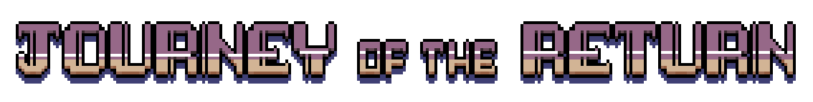

## Play the Latest Build!
I'm currently putting together the first chapter of the game, but feel free to
get the [latest build](https://github.com/hiltonjp/journey_build) and try it
out. :)

    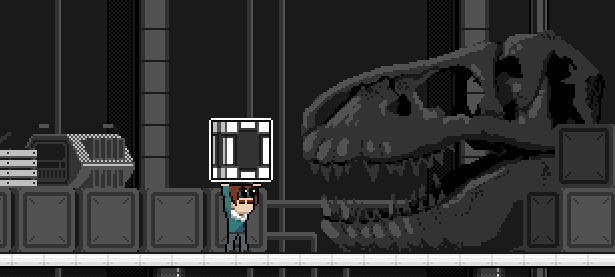

## Moment to Moment Gameplay

The game will be a mixture of world exploration, hardcore platforming sections ala Celeste, and a focus on larger-than-life boss battles. Since much of the game will take place in a city, exploring the world will require finding ways to open locked doors or bridge gaps, or convince an NPC to give the information necessary to continue forward. As the player goes along, they'll bump into robots in need of aid. The player plugs into them and starts up a classic platforming section ending in a boss battle in order to save them from their self destructive programming. The main goal of the game is find and rescue the rebelious little brother of your robot companion Ephraim and collect enough scrap metal to repair your ship and return home. 

  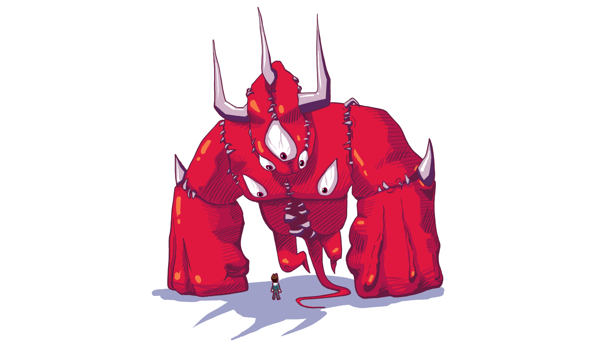

Whenever the player finds and rescues a robot, the robot will return with the player to a village where they'll stay the rest of the game.  Over time as the player rescues more robots, the appearance of the village will become more & more lively with the return of old friends and new one.

<h1 align="center">The Basic Story

  

### Act 1: Leaving the Ninety and Nine

Jerrod, an artificial intelligence expert working as a technician on a space ship called "The Return" crash lands by a small village on Nataal, a planet full of robots. He escapes from the wreckage with a few injured survivors, and is taken to the village by a robot named Ephraim in order to tend the others' wounds.

In the village of Kernelle, creature engineering revolutionizes daily life. Where we would rely on electricity, machinary, and computing to accomplish our daily work, the robots of Nataal rely on manufactured plants, bone, muscle, and bioluminescence; quite the stroke of luck for a ship full of dying crew members.

However, there's a catch. The religion of Kernelle forbids the act of engineering "robots of flesh" (i.e., humanoid creatures). As a devout society, people are willing to bring them into their homes to heal, but utterly refuse to touch them for fear of committing sin. Ephraim, knowing this and recognizing the desparation of the situation, takes Jerrod and the crew members to Brother, his younger brother. Brother agrees to see what he can do about the crew.

  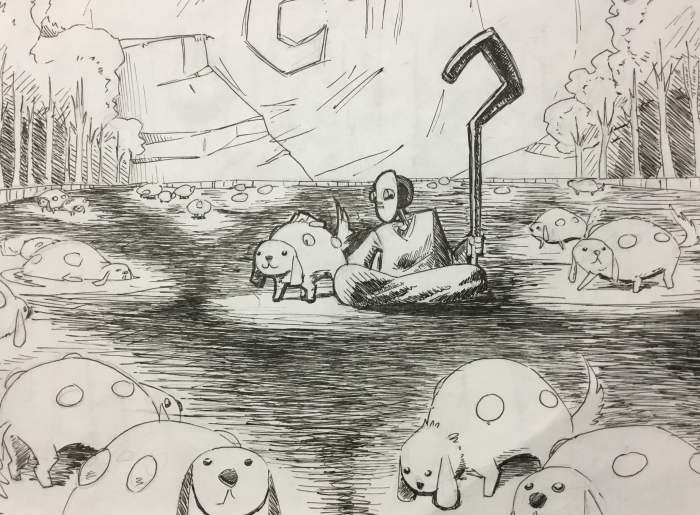

Brother operates on one of the crew members, but the crew member dies. Refusing failure as an option, Brother takes a step too far and re-animates the crew member using his creature engineering know-how. Ephraim gets into an argument with the brother over the results of the operation, and the brother decides to leave the village to head to the City of Grand Cluster, where the old traditions aren't taught. Ephraim and Jerrod decide to follow after Ephraim's brother through the desert to the city.

  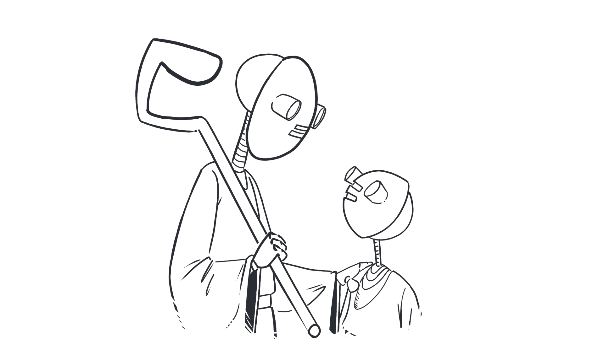

### Act 2: Lost Sheep
When Jerrod and Ephraim arrive in the city to look for the brother, they're shocked to find that the colorful allure of the city skyline gives way to a ruinous wasteland of broken down buildings and dangerous alleyways. The robots that live there have all fallen prey to idleness, addiction, or are mentally sick to one degree or another. The player notices that each of the robots has modified themselves with things like decorative perforations in their outer sheet metal, carvings, and welded-on objects & symbols. The robots there are convinced that the decaying city is still somehow better off than the peaceful village of Kernelle. The creatures that are engineered there are almost all humanoid, and serve the robots like puppets.  

  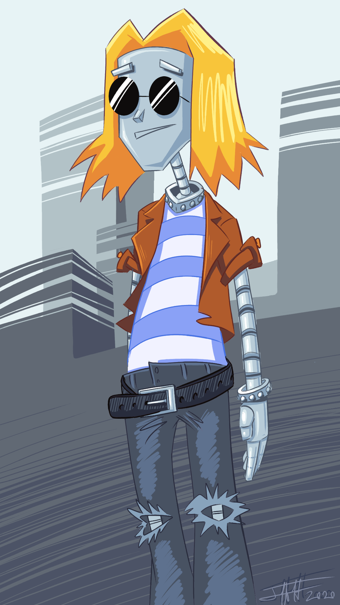
  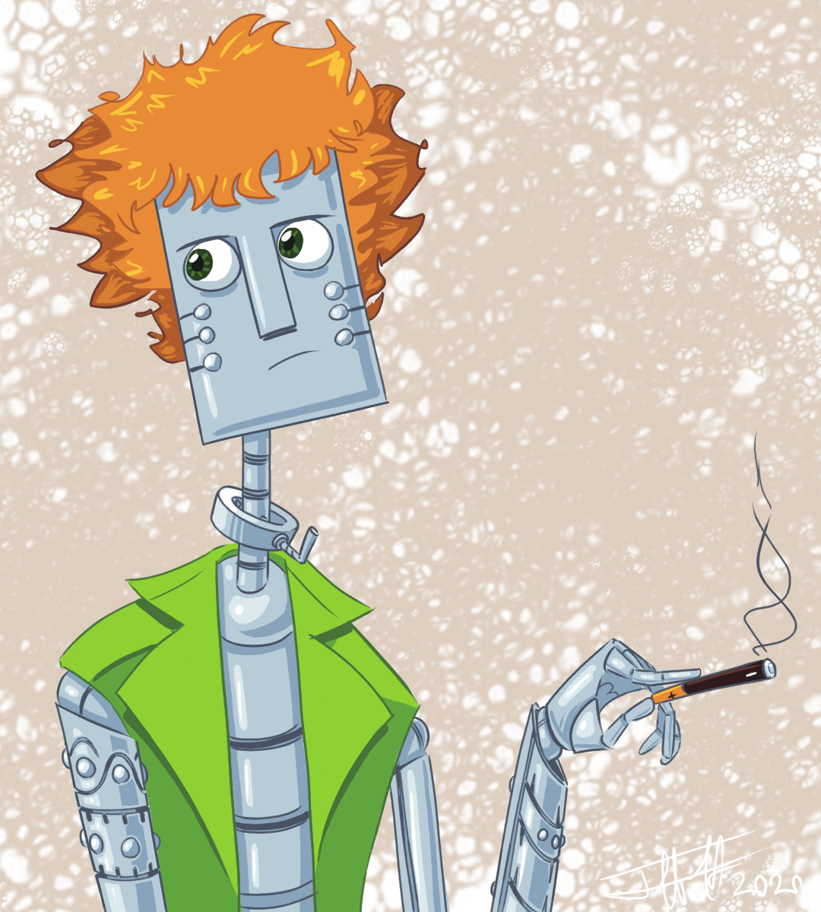

As the Ephraim and Jerrod search the city for Ephraim's brother, they find various members of the village who ran away for one reason or another. Each villager is hiding a regret or a mistake of their past that weighs on them. Some examples might include:
- An artist who feels that their work will never be unique enough
- A murderer who's haunted by the guilt of killing his friend
- A wife who married her husband for reasons other than love, and ran away
- A suicidal robot who feels they'll never measure up to basic expectations
- A robot caught up in an addiction

  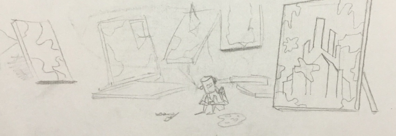

  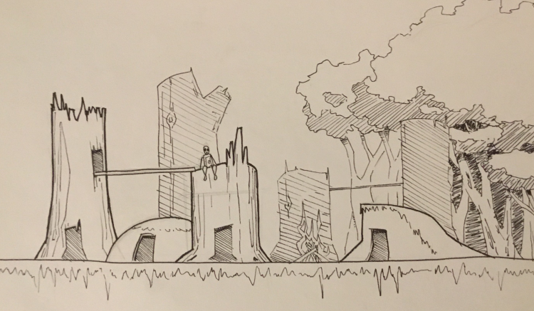

Jerrod helps them deal with the issues that caused them to run away in the first
place. In each scenario, Jerrod will have the opportunity to plug into the
robot's mind to help them deal with their problem. The player is given the
option to either use a lot of the scrap they've collected and do a full repair,
or save on scrap and do a patch job, just good enough to get the robot back home
to the village. The player then enters their mind for a breakout platforming
level & boss. 

  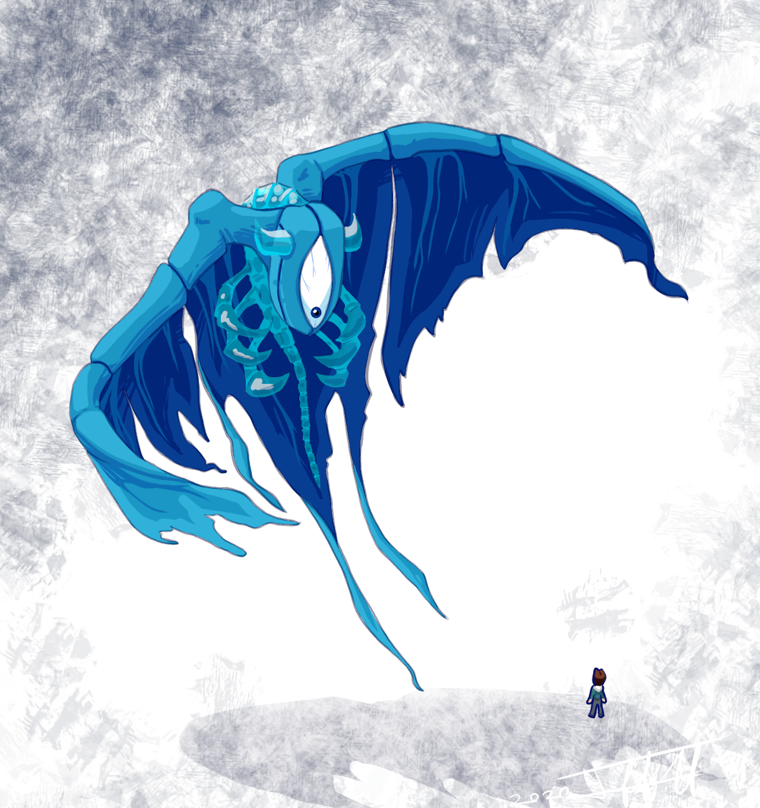

Each rescued villager gives clues as to the brother's whereabouts, taking Jerrod and Ephraim deeper and deeper into the city. And with each villager, Jerrod must reconcile his own past mistakes that caused him to run from Earth in the first place.

  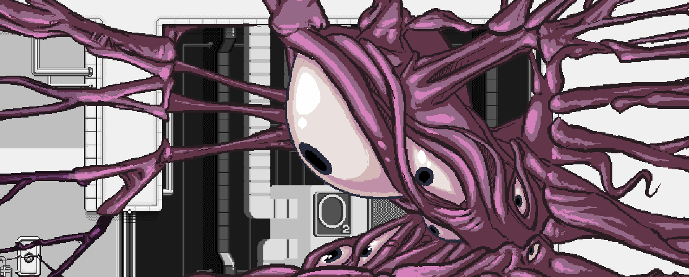

Eventually, they learn that the wayward brother has left the city and is making his way up Mt. Gigabit, a nearby mountain.

### Act 3: Healing
Jerrod and Ephraim follow after Brother, and finally catch up to him close to the summit. By this time, Brother has undergone a complete transformation from a simple farm robot to a heavily modified monstrosity. So heavily modified in fact, that he's barely functioning. Jerrod and Ephraim learn that he's here because he discovered that all robots that live on this planet come from the summit, and he's directing them away from the village and towards the city. Just as they learn this from him, he breaks down and collapses. Jerrod is able to repair his mind and get him functioning temporarily, but won't be able stop the brother from dying. While he's still conscious, the brother admits that he knew all along that he was wrong to run away, to run from traditions he knew were founded in principle, even if he couldn't explain why he knew. The brother passes out, and Jerrod and Ephraim carry the brother the rest of the way up the summit. 

They find that living at the top of the mountain is the creator of all the robots on Nataal. The creator completely fixes Brother, and invites Jerrod to come live with him on the summit of the mountain and teach him the ways of creation. Jerrod refuses, and decides he'd rather return home and face his own problems. From here, the player can experience one of two endings.

  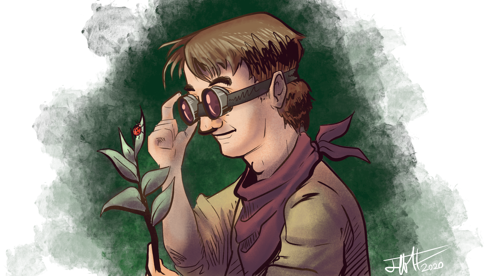

#### Ending 1
If Jerrod has enough scrap to repair his ship, he'll be seen working on his ship alongside the re-animated puppet crew member, with all of the robots he's rescued around a campfire off in the distance. Ephraim comes up from the campfire, past the graves of the rest of the crew that didn't survive the crash. He thanks Jerrod for his help bringing happiness back to the lives of the villagers.

#### Ending 2
If Jerrod does not have enough scrap to repair his ship (only possible if the player opts to fully repair every robot), the creator of the robots will offer to give him the necessary parts to do the repair. The creator follows Jerrod and Ephraim back to the village, past the graves of the rest of the crew that didn't survive the crash. Jerrod, Ephraim, the creator, and all the rescued robots including Brother are seen working on the ship in the evening. The creator notices the puppet crew member among the villagers and walks over to him. The creator pauses a moment, then places his hand over the puppet crew member's eyes, and then the crew member returns fully to life. The creator turns to see Jerrod, Ephraim, and Brother watching him in shock, and he gives them a tired smile. 

  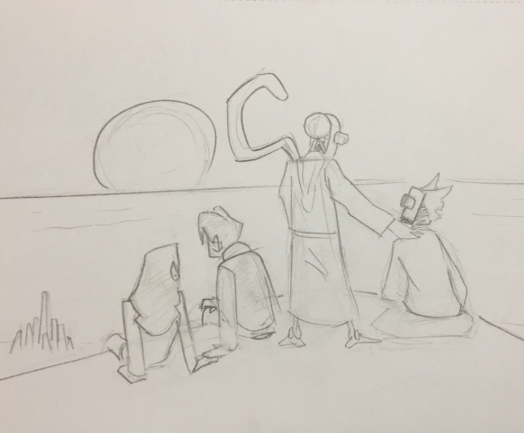

## How this Repo is Organized
The project follows the basic Unity Project structure:
* [Assets](): This is the meat of the project. Code, scenes, art, sound, animation, you name it.
* [Packages](): A shell folder. When opening the project in Unity, the manifest.json will be used to determine which Unity packages get loaded up. 
* [ProjectSettings](): Contains all of the project's global preferences and settings. 

## Getting Started with Unity
[Unity Homepage](https://unity.com)

## Getting Started with Python
[Using C# code to talk to Python and Vice Versa](https://www.codeproject.com/Articles/602112/Scripting-NET-Applications-with-IronPython)

## Ideas
Some other thoughts and ideas I'm playing with:
- I'm hoping to weave in a personal story for the character as well. The idea is that he left Earth with a laundry list full of his own problems, and by the end of the story decides to go back and face his problems and mistakes.
- The player has an AI he created who comes along with him, and who acts as a bit of a nagging shoulder angel. You later learn that his wife, who he's separated from,  actually tapped into the AI's subsystems shortly after the crash and has been watching over him, hoping that he would choose to come home.
